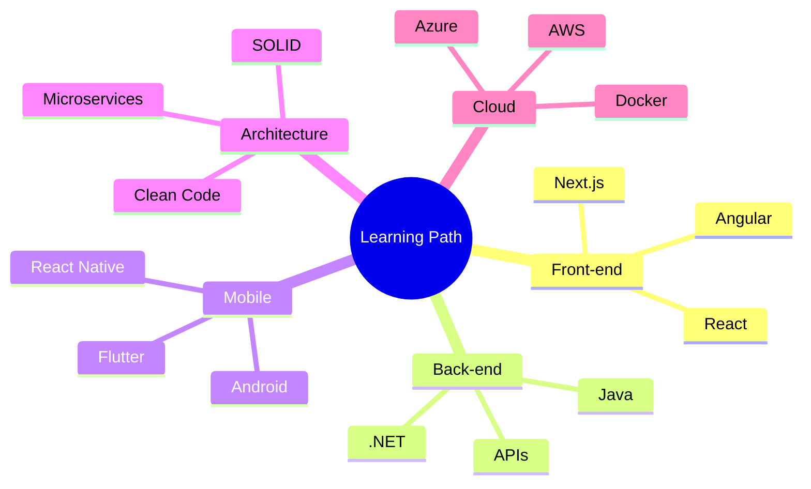

# capf01

<div align="center">


<br><br>


</div>

---

## About Me


```ts
const cesar = {
  name: "César Augusto Ferreira",
  location: "Manaus, Brazil",
  role: "Full Stack Developer",
  focus: ["Web Development", "Mobile Development", "Software Engineering"],
  currentlyLearning: ["Cloud", "DevOps", "Microservices", "AI"],
  goal: "Build scalable, secure and high-performance applications"
};
```

Desenvolvedor focado em aplicações modernas para Web, Mobile e Desktop.  
Apaixonado por tecnologia, arquitetura limpa, performance e boas práticas.  
Sempre estudando novas soluções para transformar ideias em sistemas reais.  

---

##  Tech Stack

<div align="center">

### Languages


### Front-end


### Mobile


### Database & Cloud


### Tools


</div>

---

## GitHub Analytics

<div align="center">


</div>

---


## Contribution Activity

<div align="center">


</div>

---

##  Snake Animations

###

<p align="center">
  
</p>

---

##  Currently Improving



---

## Featured Projects

<div align="center">

<table>
<tr>
<td width="50%">

###  FrioMarket
Marketplace para refrigeração, climatização, peças e serviços.

**Stack:** Next.js, Firebase, Tailwind, TypeScript

</td>
<td width="50%">

###  Elite Tintas App
Aplicativo mobile para catálogo, pedidos e atendimento.

**Stack:** React Native, API, Database

</td>
</tr>

<tr>
<td width="50%">

### Construtora Vieira
Website institucional moderno e responsivo.

**Stack:** HTML, CSS, JavaScript

</td>
<td width="50%">

### Sistemas Web
Soluções administrativas, dashboards e automações.

**Stack:** Angular, .NET, SQL

</td>
</tr>
</table>

</div>

---

##  Contact Me

<div align="center">

<a href="mailto:cesaraugustopacheco@gmail.com">

</a>

<a href="https://linkedin.com/in/capf01">

</a>

<a href="https://github.com/capf01">

</a>

</div>

---

<div align="center">


### ⭐ Thanks for visiting my profile!

</div>
